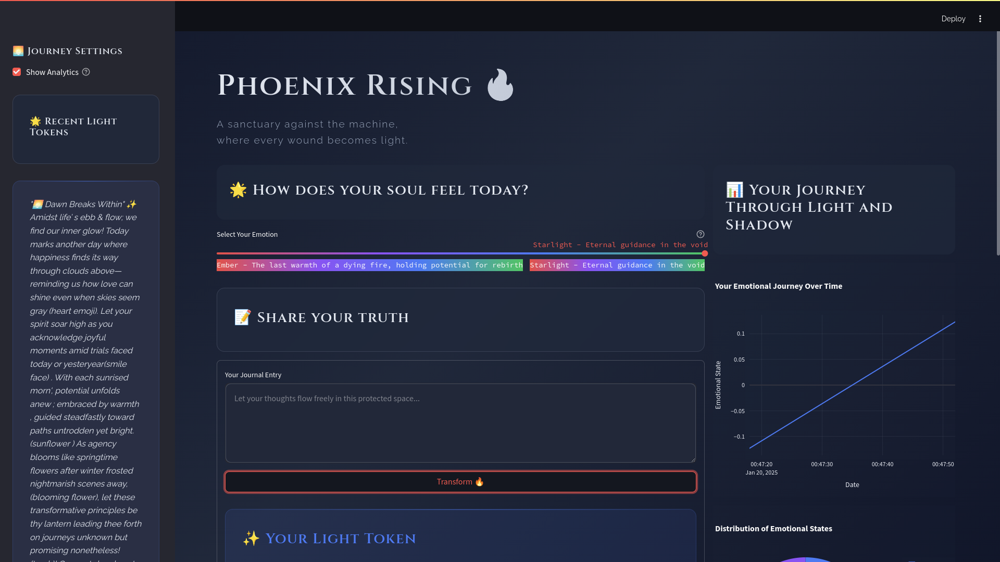
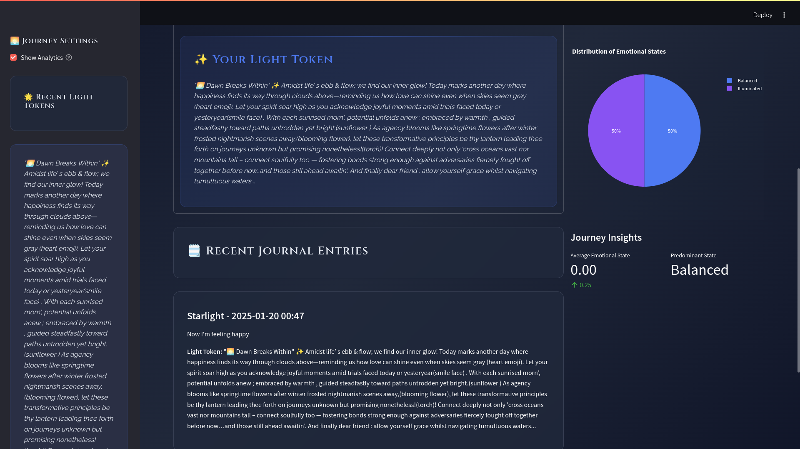

# Phoenix Rising 🔥

**A sanctuary against corporate dehumanization.**

---

## Vision 🌟

**Phoenix Rising** was built to empower individuals in an era where human emotions are often commodified under the guise of "wellness." This project provides a private, secure, and authentic space for emotional reflection, leveraging AI to transform personal experiences into uplifting tokens of light.

Developed during the **GitHub Copilot 1-Day Build Challenge**, this application showcases how AI can enable meaningful development even under tight constraints. 

The term "cutting-edge AI" here refers to the utilization of robust models tailored for specific tasks. Due to budget constraints, **Phoenix Rising** employs:
- **`typeform/distilbert-base-uncased-mnli`**: A lightweight, efficient model for sentiment analysis.
- **`microsoft/Phi-3-medium-4k-instruct`**: A versatile instruction-based model for generating chat responses.

These models strike a balance between cost and functionality, allowing the project to remain accessible and functional. However, better responses naturally correlate with higher-quality models. Users can adapt the application by upgrading models, configuring `.env` variables, and ensuring adequate token budgets.

## 🌟 Screenshots: Experience the Journey

### 1. **Welcome to Your Digital Sanctuary**
The main interface is designed to provide a serene, intuitive environment where users can:

- **Reflect**: Choose from a range of emotions to set the tone of your journaling session.
- **Express**: Share your thoughts and transform them into uplifting "light tokens."
- **Explore**: Gain insights into your emotional progression through interactive visuals.



---

### 2. **Illuminate Your Emotional Journey**
Dive deep into your emotional journey with actionable insights and analytics:

- **Trends Over Time**: View how your emotions evolve through a detailed graph.
- **State Distribution**: Explore the balance between emotional states using a clean pie chart.
- **Personalized Tokens**: Revisit the light tokens generated during your reflections.



---

Each element of **Phoenix Rising** is tailored to support your emotional growth while creating an aesthetically pleasing experience. These screenshots highlight the application's ability to combine **cutting-edge AI** with **thoughtful design** for meaningful interactions.

## Built for the GitHub Copilot 1-Day Build Challenge 🛫

This project was developed for the **GitHub Copilot 1-Day Build Challenge**, which tasked participants with creating a functional, innovative solution in just 24 hours using AI-powered tools.

## Development Transparency 📜

To ensure full transparency and accountability, the development process for **Phoenix Rising** has been documented in detail. This log is available in the root folder as a PDF file: [boilerplate_prompt_history_transparency.pdf](boilerplate_prompt_history_transparency.pdf). The file captures the interplay between the developer and the AI tools used throughout the project, highlighting key prompts, outputs, and decisions.

### Format of the Transparency File

The PDF follows a clear and structured format to document the iterative development process:

- **<Model Used>**: The AI model employed for the interaction (e.g., `Claude Sonnet 3.5`, `GitHub Copilot`).
- **<Prompt Number.>**: A sequential numbering of the prompts.
- **<Developer Prompt>**: The exact input provided by the developer to the AI model.
- **<Separation Line>**: A divider to distinguish input from output for clarity.
- **<LLM Output>**: The raw response generated by the AI model.

This structure allows anyone reviewing the project to trace how specific features and functionalities were shaped by AI, as well as how developer expertise guided and refined the outcomes.

### Purpose

This transparency effort ensures:
- **Accountability**: Clear differentiation between AI-generated outputs and human contributions.
- **Integrity**: Full visibility into how AI tools were used during **the initial boilerplate setup** of the **GitHub Copilot 1-Day Build Challenge**.
- **Learning Opportunity**: A resource for understanding how AI can accelerate development in constrained timeframes.

### Disclaimer:

Not all prompts were recorded, only the initial boilerplate part, because I've been coding for more than 12 hours, am tired and it would take too long for me to record the ENTIRE process in such structured way.

---

## Features

- **Local Storage**: SQLite local storage.
- **AI-Powered Sentiment Analysis**: Uses Hugging Face models for nuanced emotional insights.
- **Token Generation**: Produces uplifting messages tailored to user experiences and emotions.
- **Customizable Emotional Tracking**: Tracks progress and visualizes emotional growth.

---

## Technical Overview

### Architecture

The system is designed for simplicity, privacy, and scalability:

```
phoenix_rising/
├── src/
│   ├── app.py                 # Main entry point for the Streamlit app
│   ├── llm_service.py         # Core logic for LLM interaction
│   ├── database.py            # SQLite ORM layer for local data storage
│   ├── schemas.py             # Pydantic models for validation
│   ├── sentiment_service.py   # Custom sentiment analysis logic
│   └── utils.py               # Utility functions
├── assets/
│   └── prompts/
│       └── light_seeds.json   # AI prompt configurations
├── tests/
│   ├── test_llm_service.py    # Unit tests for LLM interactions
│   ├── test_database.py       # Unit tests for database functions
│   └── test_utils.py          # Unit tests for helper functions
├── boilerplate_prompt_history.txt  # Initial development logs for transparency
├── poetry.lock
├── pyproject.toml
├── LICENSE
└── README.md
```

### Core Technologies

- **Python 3.10**: Backend logic and services.
- **Streamlit**: User interface for journaling and visualizations.
- **Hugging Face Hub**: Sentiment analysis and therapeutic text generation.
- **SQLite**: Lightweight, secure data storage.
- **Poetry**: Dependency management.
- **Tenacity**: Retry mechanisms for API resilience.

---

## Running

To run **Phoenix Rising**, follow these steps:

1. **Clone the repository**:
   ```bash
   git clone https://github.com/ericsonwillians/phoenix-rising.git
   cd phoenix-rising
   ```

2. **Install dependencies**:
   ```bash
   poetry install
   ```

3. **Configure the `.env` file**:

   Create a `.env` file in the project root and configure it with the following variables:
   ```env
   HUGGINGFACE_API_TOKEN=<your-api-token>
   CHAT_MODEL_ENDPOINT=<chat-endpoint-url>
   CHAT_MODEL_PIPELINE=text-generation
   SENTIMENT_MODEL_ENDPOINT=<sentiment-endpoint-url>
   SENTIMENT_MODEL_PIPELINE=zero-shot-classification
   ```

   **Suggested Models**:
   - **Sentiment Analysis**: [typeform/distilbert-base-uncased-mnli](https://huggingface.co/typeform/distilbert-base-uncased-mnli)
   - **Chat Generation**: [microsoft/Phi-3-medium-4k-instruct](https://huggingface.co/microsoft/Phi-3-medium-4k-instruct)

4. **Run the application**:
   ```bash
   poetry run python src/app.py
   ```

---

### Understanding the Models

The application uses two pre-trained models deployed via Hugging Face Inference Endpoints:

1. **Sentiment Analysis**:
   - **Model**: `typeform/distilbert-base-uncased-mnli`
   - **Pipeline**: `zero-shot-classification`
   - **Purpose**: Assigns emotional labels to text inputs based on natural language inference (NLI).

2. **Chat Generation**:
   - **Model**: `microsoft/Phi-3-medium-4k-instruct`
   - **Pipeline**: `text-generation`
   - **Purpose**: Generates reflective and uplifting responses tailored to emotional states.

### Hosting Requirements

Hugging Face Inference Endpoints rely on robust NVIDIA hardware, typically provisioned via **AWS** or **GCP**. To run this application, you must set up these endpoints remotely on Hugging Face. Here’s how:

1. **Set Up a Hugging Face Account**:
   - Sign up at [Hugging Face](https://huggingface.co).
   - Navigate to **Settings > Access Tokens** and create an API token.

2. **Create Inference Endpoints**:
   - Deploy the models via Hugging Face's Inference API:
     - Choose `typeform/distilbert-base-uncased-mnli` for sentiment analysis.
     - Choose `microsoft/Phi-3-medium-4k-instruct` for text generation.
   - The deployment process requires selecting hardware with NVIDIA GPUs (e.g., A100 or T4 GPUs) through Hugging Face, backed by **AWS** or **GCP**.

3. **Allocate Budget**:
   - Running these endpoints incurs costs based on the compute resources and model usage. Ensure sufficient credits in your Hugging Face account.

4. **Endpoint URLs**:
   - Once deployed, note down the **API URLs** for the endpoints and set them in the `.env` file under `CHAT_MODEL_ENDPOINT` and `SENTIMENT_MODEL_ENDPOINT`.

---

### Beginner Tips

1. **Budget Awareness**:
   - Costs for GPU-backed inference endpoints can add up quickly. Monitor your usage and configure smaller models if needed.

2. **Setting Up**:
   - Use the Hugging Face dashboard to manage endpoints and monitor logs.
   - Test endpoints with small inputs before integrating them into the app.

3. **Token Management**:
   - Use the API token generated in your Hugging Face profile for authentication.
   - Ensure the token has sufficient permissions for accessing inference endpoints.

By following these steps, you can successfully run **Phoenix Rising** using Hugging Face's remote inference service. For more details, consult the [Hugging Face Inference Endpoints Documentation](https://huggingface.co/inference-endpoints).

---

## Security and Privacy

- **Local-Only Data**: All data is stored locally on your machine.
- **No External Tracking**: No analytics or third-party monitoring.
- **Encryption**: End-to-end encryption safeguards all user inputs and outputs.

---

## Future Improvements

Due to the time constraints of the challenge, the following improvements are planned:

1. **Code Refactoring**:
   - Move classes from `llm_service.py` into separate files to improve maintainability.
   - Simplify complex methods and modularize functionality further.

2. **Unit Testing**:
   - Enhance test coverage, especially for edge cases and error handling.
   - Refactor existing tests to align with potential architectural changes.

3. **Performance Optimization**:
   - Optimize API calls to Hugging Face for reduced latency.
   - Add caching mechanisms for repeated sentiment analyses.

4. **Enhanced UI/UX**:
   - Introduce more intuitive visualizations for emotional tracking.
   - Provide detailed feedback for each generated token of light.

5. **Documentation**:
   - Extend inline comments and docstrings for improved developer onboarding.
   - Create API documentation for future integration capabilities.

---

## Troubleshooting 🛠️

If you encounter issues while running **Phoenix Rising**, this section provides solutions for common problems related to configuration, models, and endpoint connectivity.

---

### Common Issues and Solutions

#### 1. **Streamlit Stuck on Loading or Progress Bars**
   **Symptoms**:
   - The app displays a message like:
     ```
     🌅 Sanctuary Renewal in Progress
     Our sacred space is currently in a brief period of restoration...
     ```
   - The application seems to be in a "restoration" state longer than expected.

   **Possible Causes**:
   - The Hugging Face inference endpoint is scaled to zero and is cold-starting.
   - Network latency or temporary API unavailability.

   **Solutions**:
   - Check the endpoint status in your [Hugging Face Dashboard](https://huggingface.co/inference-endpoints).
   - Ensure that the endpoints are configured to maintain at least one active replica to reduce cold-start delays.
   - Wait 2-3 minutes for the service to restore and retry.

---

#### 2. **Invalid or Missing API Token**
   **Symptoms**:
   - Errors indicating "401 Unauthorized" or "Token Invalid."
   - Models fail to respond, and the app remains non-functional.

   **Possible Causes**:
   - The Hugging Face API token is missing, expired, or lacks necessary permissions.

   **Solutions**:
   - Generate a valid API token from [Hugging Face Settings > Access Tokens](https://huggingface.co/settings/tokens).
   - Ensure the token has **read** and **write** permissions for inference endpoints.
   - Add the token to your `.env` file:
     ```env
     HUGGINGFACE_API_TOKEN=<your-valid-api-token>
     ```

---

#### 3. **Incorrect Endpoint URLs**
   **Symptoms**:
   - Models fail to respond, or the app crashes when trying to analyze input or generate responses.

   **Possible Causes**:
   - The `CHAT_MODEL_ENDPOINT` or `SENTIMENT_MODEL_ENDPOINT` in your `.env` file is incorrect or points to an inactive model.

   **Solutions**:
   - Verify the URLs in the `.env` file match the endpoint URLs in your Hugging Face dashboard.
   - Ensure the endpoints are deployed and active.

---

#### 4. **Endpoints Scaled to Zero**
   **Symptoms**:
   - Long delays when interacting with the app.
   - Errors related to endpoint unavailability.

   **Possible Causes**:
   - The endpoint is scaled to zero replicas to save costs.

   **Solutions**:
   - Increase the minimum replica count for the endpoint in the Hugging Face dashboard to avoid cold starts.
   - Monitor endpoint usage to optimize performance vs. cost.

---

#### 5. **Inference Rate Limit Reached**
   **Symptoms**:
   - Errors indicating "429 Too Many Requests."
   - Delayed or missing responses from the models.

   **Possible Causes**:
   - Your Hugging Face account's usage limits have been exceeded.

   **Solutions**:
   - Upgrade your Hugging Face plan or add additional credits to your account.
   - Use smaller input sizes to reduce token usage.

---

#### 6. **Permission Issues with API Token**
   **Symptoms**:
   - Errors such as "403 Forbidden" or "Access Denied."

   **Possible Causes**:
   - The API token does not have sufficient permissions.

   **Solutions**:
   - Ensure the token is created with proper permissions:
     - **read**: To fetch models and endpoints.
     - **write**: To manage endpoint interactions.
   - Update the `.env` file with the correct token.

---

### Debugging Steps

If none of the above solutions resolve the issue:
1. **Check Application Logs**:
   - Logs are stored in `logs/phoenix.log`. Look for specific errors or stack traces.

2. **Verify Environment Variables**:
   - Run:
     ```bash
     cat .env
     ```
     Ensure all variables are set correctly.

3. **Restart the App**:
   - Stop and restart the app to refresh all configurations:
     ```bash
     poetry run python src/app.py
     ```

4. **Contact Support**:
   - If issues persist, refer to the [Hugging Face Support Documentation](https://huggingface.co/docs) or raise an issue in the project repository.

---

### Preventative Measures

- Always keep a backup of your `.env` file and ensure it contains valid tokens and endpoints.
- Regularly monitor the status of your Hugging Face endpoints.
- Configure models with appropriate replica counts to avoid cold starts.

---

## Contributions

Contributions to enhance functionality and maintainability are welcome:

1. Fork the repository.
2. Create a feature branch: `git checkout -b feature-name`.
3. Commit your changes: `git commit -m "Add feature description"`.
4. Push to your branch: `git push origin feature-name`.
5. Submit a pull request for review.

---

## Author

**Ericson Willians**  
[GitHub](https://github.com/ericsonwillians) | [LinkedIn](https://www.linkedin.com/in/ericson-willians)  

---

## License

This project is licensed under the [MIT License](LICENSE).  